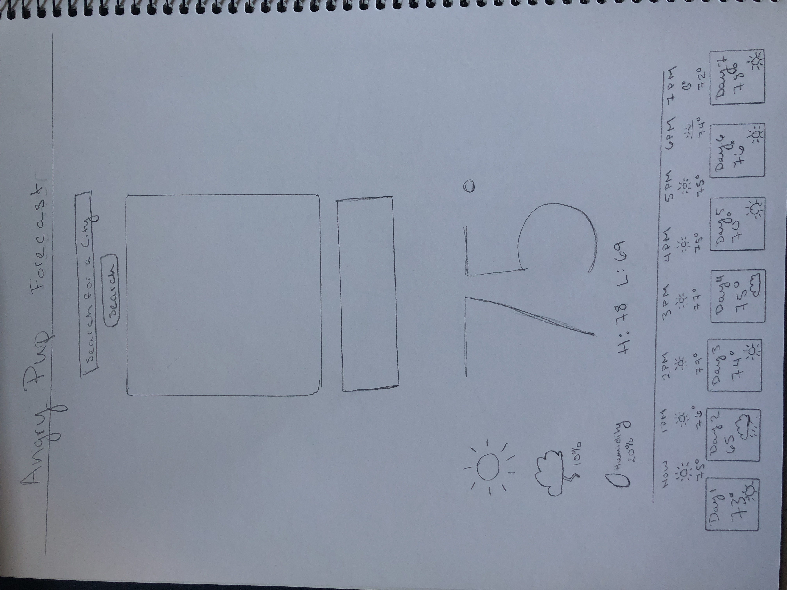
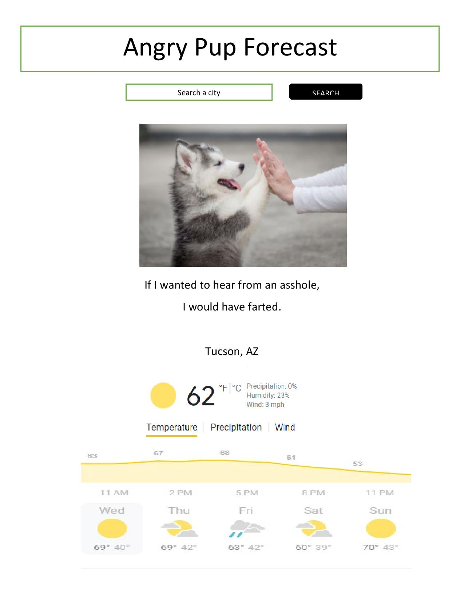

# Angry-Pup-Forecast
## Description

Who are we building this for?
We are building this for people with a sense of humor that like dogs and need a forecast.
What is the user trying to achieve?
The user is trying to expand their lexicon of insults, while making sure they are well dressed for the day.
Why do they want to achieve this?
They do not always remember to look for random insults but they ARE in the habit of looking for the weather daily.
How does it work?
Given that I am a user who has a sense of humor, likes puppies, and needs to see the weather every day. When I type any city into a search query, a photo of a random puppy is generated along with a random insult, this will include the weather forecast for that day and the next 5 days of the searched city. 

## User Story
## Website Art

